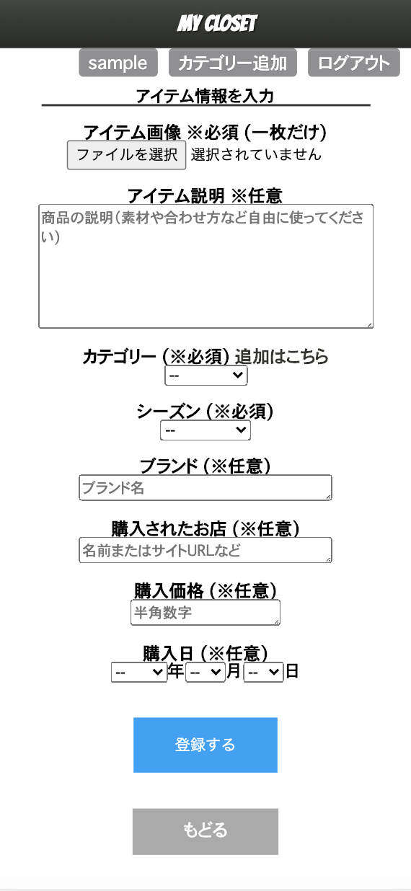
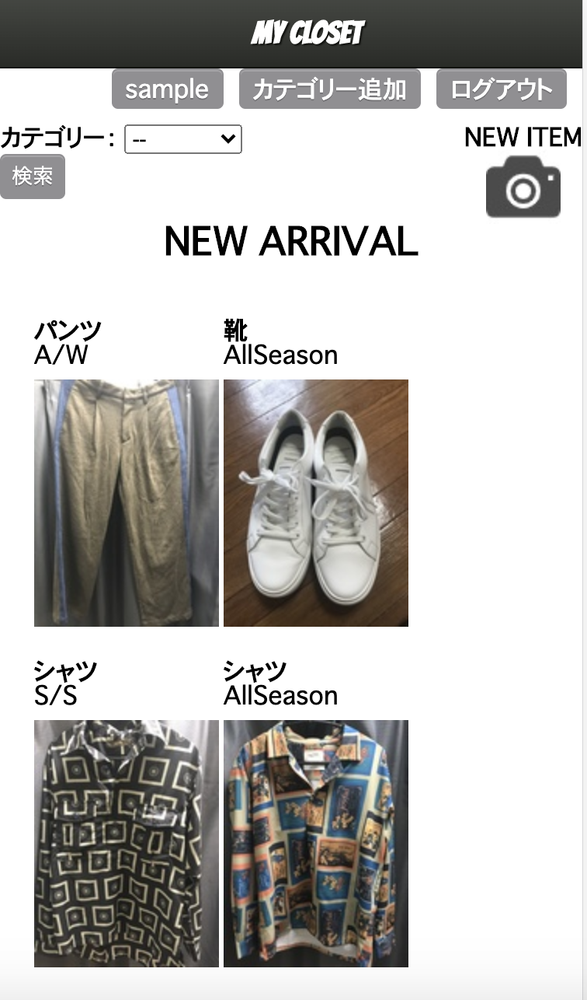

# テーブル設計

## users テーブル

| Column                   | Type    | Options      |
| --------                 | ------  | ------------ |
| nickname                 | string  | null: false  | 
| email                    | string  | null: false  |
| password                 | string  | null: false  |

### Association

- has_many :items

##  itemsテーブル

| Column           | Type        | Options                        |
| ---------------  | ----------  | -----------------------------  |
| user             | references  | null: false, foreign_key: true |
| explanation      | text        |                                | 
| category_id      | integer     | null: false                    |
| brand            | string      |                                |
| parchase_day     | date        |                                |
| price            | string      |                                |
| season_id        | integer     | null: false                    |
| place            | string      |                                |

### Association

- belongs_to :user
- belongs_to :category

## cotegories テーブル

| Column                   | Type        | Options                        |
| --------                 | ------      | ------------                   |
| user                     | references  | null: false, foreign_key: true |
| name                     | string      | null: false                    | 

### Association

- has_many :items

# MYCLOSET

## 概要

このアプリは自分の持っている服や靴、小物などを管理できるアプリになっています。

お使いの場合は、スマートフォンを推奨しております。

自分が持っている服などを写真付きで保存することができます。

店先で自分が持っている服を確認したい時、今日どんな服を着て行こうか悩んでいる方の手助けになればと思っております。

## 本番環境

 http://54.150.16.244

## テスト用アカウント等

### Basic認証

ID: admin

Pass: 2222

### テストアカウント

Email: samplesample@sample.com

Password: sample1

## 制作背景

私はよく服を買いに行く際に自分のどの服と合わせよう、似たような服持ってないかと悩んでしまい結局買わないという事がよくありました。そんな時に自分が持っている服をその場で確認できたら買い物がもっとしやすくなると思いました。自分のような悩みを抱えている人にも使っていただきたいと思い制作しました。

## DEMO

Top画面からユーザー登録、ログインできます。

投稿画面では、画像とカテゴリーとシーズンを登録する事で投稿できます。他にも購入日やお店なども情報として登録できます。

ログイン後のトップページから自分が登録したアイテムをみる事ができます。

## 工夫したポイント

今回使い場所が店先などになることを考え携帯から簡単に使えるようにしています。その為VIEWも携帯から見やすく設定しました。また登録したアイテムの編集、削除も可能です。初めは予めカテゴリーを用意しておいたのですが、ユーザーの使用の自由度をあげるためにカテゴリーも登録できるようにしました。その際は一つのページで登録、編集、削除が可能にしてあります。

